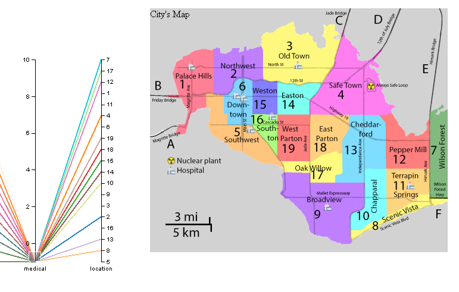

# VAST 2019 - Mini Challenge 1

App's Link: https://idatavisualizationlab.github.io/VAST19_mc1/

## Questions
- Emergency responders will base their initial response on the earthquake shake map. Use visual analytics to determine how their response should change based on damage reports from citizens on the ground. How would you prioritize neighborhoods for response? Which parts of the city are hardest hit? Limit your response to 1000 words and 10 images.
Provide your answer and corresponding images here.
- Use visual analytics to show uncertainty in the data. Compare the reliability of neighborhood reports. Which neighborhoods are providing reliable reports? Provide a rationale for your response. Limit your response to 1000 words and 10 images.
Provide your answer and corresponding images here.
- How do conditions change over time? How does uncertainty in change over time? Describe the key changes you see. Limit your response to 500 words and 8 images.

## Data:
- Time filtering
- Average values by entries in a given time-step within the range
- Process null value 
- mc1-reports-data.csv fields:
    - time: timestamp of incoming report/record, in the format YYYY-MM-DD hh:mm:ss
    - location: id of neighborhood where person reporting is feeling the shaking and/or seeing the damage
    - {shake_intensity, sewer_and_water, power, roads_and_bridges, medical, buildings}: reported categorical value of how violent the shaking was/how bad the damage was (0 - lowest, 10 - highest; missing data allowed)
- Also included are two shakemap (PNG) files which indicate where the corresponding earthquakes' epicenters originate as well as how much shaking can be felt across the city.

## Tasks:
- Plot events from dataset on a map with different types of damage (Geospatial) (Darien, Hao)
- Plot events over time as a line graph, with approximated lines and outlying points with areas of standard deviation (Darien, Nhat)
- Plot events over animated time with a parallel coordinate graph (Nhat, Hao)
## Functionality:
- Categorize by areas and types of damage
- We can show calculated total damage when categorizing by area
- Plot approximation lines
- Plot areas of deviation
- Show all levels of damage individually
- We can show approximation and deviation within a certain timestep
- We can use a drop-down or a log-scale slider
- Filter the data by time range
- We can use a brush or double slider
## Line Graph:

## Observations:
Reports of "medical" damage (or lack thereof) coincides with the presence of hospitals in the area

## Answer questions
### Question 1: 
Comparing with major-quake shake map, it shows that:
- Location: 3,4,7,12 are impacted significantly
- Location: 2,13,16,17,18,19,11 are impacted minor
- Location: 1,5,6,15,8,9 might have less impact.
Based on our visualization, it shows that the level of damage of each location is change over time.

The event begins on 04/08

Major quake on 04/09:

Observer the hardest hit part: Location 3

Priotize the reponse based on the level of damage over-time.

### Question 2: 
In this question, we focus on two things, the number of the report and the damage level on each report, to determine uncertainty of a location.
- In this challenge we focus on the times that has large amount of reports which is showed in two following pictures
 
 
- From that time in large amount of reports, we use mean and quartiles to focus on uncertainty of each damgage feature on each location. With the line graph, we make some blur for the range of quartiles, which means further from mean, the more blur in the line graph, which leads to more uncertainty at that time in that location.  

In these pictures that show the location is certain because of few blur in the graphs. We have 2 cases that lead to that result. First, the reporter know the same level of damage for each report. Second, it's small amount number of the reports.
Besides, we compare to locations that has uncertain reports for whole time. 

and 
On the map, I saw location 15 - Weston is close to 3 hospitals and close to the area suffered hardest hit from earthquake, so it will have more reports from people evacuated from many places.  

In the limit in this report, we will focus on large number of the reports, at the time before 12PM on Wed 08 (red oval mark in above picture)   
    + Based on the time, we note some location with higher number of reports, which are Palice Hills, Old Town, Scenic Vista, BroadView, and Easton. 
    
    
    
    
    In this time, we saw Palace Hills is the most certain, and other locations which is close to the earthquake lose some report data. 
    
